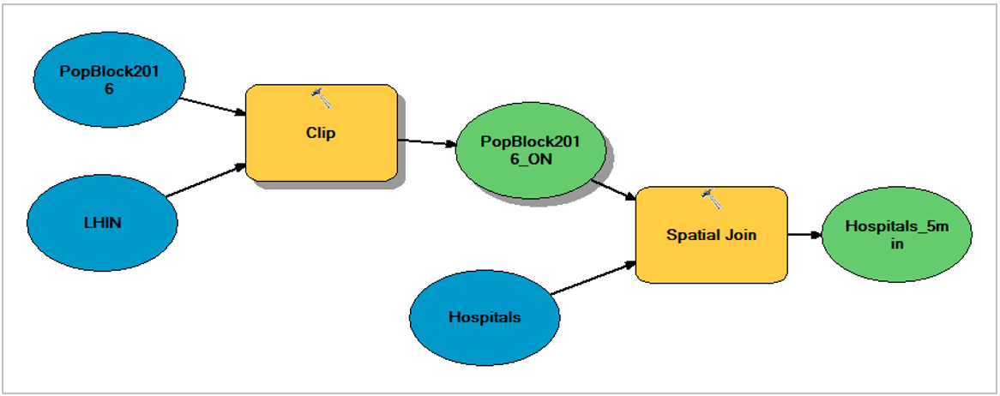

1. Method I: Model Builder  

  

2. Mothod II: Python  

Model builder is a great way to manage work flow and tasks in GIS. However, if we were to find populations within 5, 10, 20, and 30 min travel time to a hospital, model builder can become quite tedious and time consuming. **This redundant task can be automated with Python to improve efficiency.** Python codes are provided below to automate this task:  

```{r python, eval = FALSE}
## 10 min
import arcpy
... Hospitals = "Hospitals"
... PopBlock2016 = "PopBlock2016"
... LHIN = "LHIN"
... PopBlock2016_ON = "C:\\yourfilepath.gdb\\PopBlock2016_ON"
... arcpy.SpatialJoin_analysis(
  Hospitals, PopBlock2016_ON, “Hospitals_10min”, "JOIN_ONE_TO_ONE", "KEEP_COMMON", 
  "HOSP \"HOSP\" true true false 80 Text 0 0 ,First,#,Hospitals,HOSP,-1,-1;
  DBpop_2016 \"DBpop_2016\" true true false 4 Long 0 0 ,
  Sum,#,C:\\yourfilepath.gdb\\PopBlock2016_ON,DBpop_2016,-1,-1", 
  "WITHIN_A_DISTANCE", "48 Kilometers", "")

## 20 min
import arcpy
... Hospitals = "Hospitals"
... PopBlock2016 = "PopBlock2016"
... LHIN = "LHIN"
... PopBlock2016_ON = "C:\\yourfilepath.gdb\\PopBlock2016_ON"
... arcpy.SpatialJoin_analysis(
  Hospitals, PopBlock2016_ON, "Hospitals_20min", "JOIN_ONE_TO_ONE", "KEEP_COMMON", 
  "HOSP \"HOSP\" true true false 80 Text 0 0 ,First,#,Hospitals,HOSP,-1,-1;
  DBpop_2016 \"DBpop_2016\" true true false 4 Long 0 0 , 
  Sum,#,C:\\yourfilepath.gdb\\PopBlock2016_ON,DBpop_2016,-1,-1", 
  "WITHIN_A_DISTANCE", "96 Kilometers", "")

## 30 min
import arcpy
... Hospitals = "Hospitals"
... PopBlock2016 = "PopBlock2016"
... LHIN = "LHIN"
... PopBlock2016_ON = "C:\\yourfilepath.gdb\\PopBlock2016_ON"
... arcpy.SpatialJoin_analysis(
  Hospitals, PopBlock2016_ON, "Hospitals_30min", "JOIN_ONE_TO_ONE", "KEEP_COMMON", 
  "HOSP \"HOSP\" true true false 80 Text 0 0 ,First,#,Hospitals,HOSP,-1,-1;
  DBpop_2016 \"DBpop_2016\" true true false 4 Long 0 0 ,
  Sum,#,C:\\yourfilepath.gdb\\PopBlock2016_ON,DBpop_2016,-1,-1", 
  "WITHIN_A_DISTANCE", "144 Kilometers", "")


```


