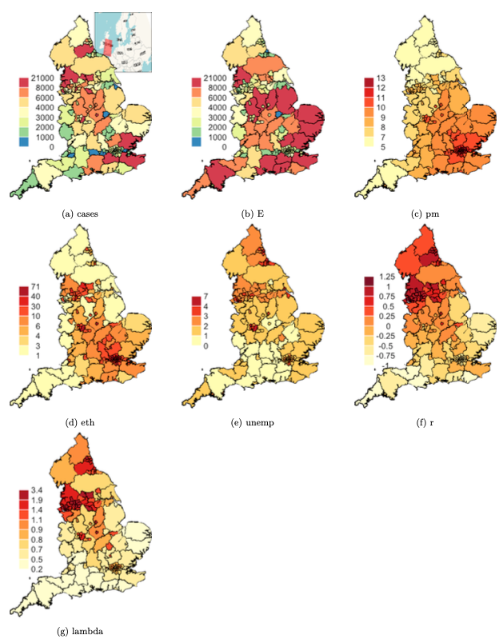

```{r q2loaddata, include = FALSE, eval = TRUE, message = FALSE, warning = FALSE}
(load("England_shp.RData"))
(load("englandRes.RData"))
library(tidyverse)
```

Many academic research projects have been dedicated to COVID-19 since the onset of global pandemic in early 2020. One study suggests a positive correlation between COVID-19 in areas with high unemployment, as such areas tend to have high deprivation and low access to health care. Moreover, many studies have documented that COVID-19 is more prevalent in areas with many ethnic minorities. Some hypotheses suggest this is because ethnic minorities are more likely to live in large, multi-generational households, work in high-risk occupations, and structural racism making access to health care harder.  

### *The research question of interest involves whether exposure to ambient air pollution makes individuals more susceptible to COVID-19. It is hypothesized that there are more cases where air pollution is high because air pollution puts stress on the lungs and respiratory tract. Building on existing research and hypotheses, we will also use factors such as ethnicity and unemployment rate to account for COVID-19, in addition to air pollution values.*  


# Methods  
In order to fit a statistically robust model that quantifies the problem, air pollution measurement data collected on public health region level in England, as provided internally by colleagues and collaborators, were used to analyze the research question of interest.  
As we are interested in examining whether exposure to ambient air pollution makes individuals more susceptible to COVID-19 in England, a bayesian spatial model BYM with poisson distribution was fitted to the data, as shown below:  

```{r model, eval=FALSE}
# bym model with weakly informed priors, encouraging data to tell the story
englandRes= diseasemapping::bym(
  cases ~ offset(logExpected) + Ethnicity + modelledpm25 + Unemployment,
  prior = list(sd = c(0.5, 0.05), propSpatial = c(0.99, 0.01)),
  family = 'poisson',
  data = UK2)
```

$$
\begin{aligned}
Y_{i} \sim & \text{Poisson}(E_{i}\lambda_{i})\\
\text{log}(\lambda_i) = & \mu + \boldsymbol{X_{i}\beta} + U_i\\
U_i \sim& BYM(\sigma^2, \tau^2)\\
\theta_1 = & \sqrt(\sigma^2 + \tau^2)\\
\theta_2 = & \sigma/\sqrt(\sigma^2 + \tau^2)\\
\end{aligned}
$$


$Y_i$, following a poisson distribution, represents the COVID-19 case count in health region i. $E_i$ is the expected case count, as computed from population data and known incidence rates. $\lambda_i$ represents the risk in health region i. Because risk $\lambda_i$ needs to be positive, we have log of $\lambda$ so that it can be treated as Gaussian with intercept $\mu$, covariates $X_i\beta$, and spatial random effect $U_i$ which consists of 2 standard deviation parameters: $\sigma^2$ for spatial and $\tau^2$ for independent. $\theta_1$ is the total variance of $U$ at region i. $\theta_2$ is the spatial proportion explaining total variation.  

As for $X_i\beta$, it is a vector of covariates including the log of expected case count (logExpected), percent of individuals who are ethnic minorities (Ethnicity), percent of individuals who are unemployed (Employment), and concentrations of fine particulate matter PM2.5 in the health authority (pm25modelled). In an effort to scale the model of mean, the expected case count was included as an offset term with a log link because of the suspected proportional correlation between expected and actual case count.  

Penalized complexity priors were chosen for both $\theta_1$ and $\theta_2$. For the total variation of $U$ sd, the prior is c(0.5, 0.05), meaning that the probability of standard deviation is bigger than 0.5 is 5%. As for the spatial proportion, the prior is set to be c(0.99, 0.01), meaning that the probability of the spatial proportion is bigger than 99% is 1%. Prior for $\beta$ was left at INLA default. **We chose the above prior distribution to encourage the model to be boring and surface to be flat; by doing so, we can learn truly from the data whether there is anything significantly correlated.**  


# Results  

## Table of Parameters  

```{r q2tables, echo = TRUE}
# log relative risk (logged odds ratios) table
temp <- englandRes$parameters$summary[,c(1,3,5)]
temp %>%
  kableExtra::kbl(
    caption = "Parameter Posterior Means and 95% Credible Intervals
    (Log Odds)", booktabs = T, digits = 3) %>%
  kableExtra::kable_classic(full_width = F, html_font = "Cambria") %>%
  kableExtra::kable_styling(latex_options = c("HOLD_position", "striped"),
                            position = 'float_right')
```


Table 1 displays the parameter posterior means and 95% credible intervals in logged odds ratios. This table provides valuable information on the significance of variables. **If the mean is equal to, or the credible interval includes, 0, the corresponding variable is not significant.** In particular, if sd $\theta_1$ is 0, there is nothing significant, if propSpatial $\theta2$ is 0, nothing significant is spatial.  

From this table, we can conclude that **a higher proportion of unemployment rate and a higher proportion of ethnic minorities can each lead to more individuals susceptible to COVID-19 within the same health region.** Unemployment rate has a more significant effect than ethnic origins. The overall standard deviation is 0.29, meaning the covariates explain the variation in a statistically significant manner and about 90% of the variance is explained by spatial random effect. However, we do not seem to find significance in whether exposure to PM2.5 will increase the person's risk to COVID-19. The 95% credible interval includes 0, which means exposure to PM2.5 in England could lead to either an increase or decrease in the person's risk to COVID-19.  


```{r table2, echo = TRUE}
# odds ratios table
logOddsMat2 = englandRes$parameters$summary[,c(4,3,5)]
oddsMat2 = exp(logOddsMat2)
oddsMat2[1,] = oddsMat2[1,]/(1 + oddsMat2[1, ])
rownames(oddsMat2)[1] = 'Baseline prob'
oddsMat2 %>%
  kableExtra::kbl(
    caption = "BYM Model Results From Voting Data (Odds Ratio)",
    booktabs = T, digits = 3) %>%
  kableExtra::kable_classic(full_width = F, html_font = "Cambria") %>%
  kableExtra::kable_styling(latex_options = c("HOLD_position", "striped"),
                            position = 'float_right')
```


Table 2 is the interquartile range (IQR) version of table 1, displaying the parameters in odds ratio. We can conclude that **a 1% increase in the proportion of ethnic minorities in a region results in a 1.01% increase in risk for COVID-19, and a 1% increase in the proportion of unemployment residents in an area results in a 1.12% increase in risk for COVID-19.** We do not find the variable PM2.5 significance because the 95% confidence interval overlaps value 1.  

&nbsp;  

&nbsp;  

&nbsp;  

&nbsp;  

## Prior and Posterior Density Distributions  

```{r q2priorandposterior, echo=TRUE, fig.width = 6, fig.height = 3}
# prior and posteriors for SD
plot(englandRes$parameters$sd$posterior, type = 'l', xlim = c(0,1), xlab = 'sd',
     ylab = 'dens', cex.main = 0.6,
     main = 'Figure 1. Prior and Posterior Distribution for Standard Deviation')
lines(englandRes$parameters$sd$prior, col = 'grey')
legend('topright', lty = 1, col = c('black', 'grey'),
       legend = c('post', 'prior'), bty = 'n')

# prior and posterior for spatial proportion
plot(englandRes$parameters$propSpatial$posterior, type = 'l', xlim = c(0,2.5),
     xlab = 'prop spatial', ylab = 'dens', cex.main = 0.6,
     main = 'Figure 2. Prior and Posterior Distribution for Spatial Proportion')
lines(englandRes$parameters$propSpatial$prior, col = 'red')
legend('topright', lty = 1, col = c('black', 'red'),
       legend = c('post', 'prior'), bty = 'n')
```


## Maps  
```{r maps, eval = FALSE}
# maps set up
casesCol = mapmisc::colourScale(UK2$cases, dec = -3, breaks = 12,
                                col = "Spectral", style = "quantile", rev = TRUE)
Ecol = mapmisc::colourScale(UK2$E, breaks = casesCol$breaks,
                            col = casesCol$col, style = "fixed")
pmCol = mapmisc::colourScale(UK2$modelledpm25, breaks = 9,
                             dec = 0, style = "quantile")
ethCol = mapmisc::colourScale(UK2$Ethnicity, breaks = 9,
                              digits = 1, style = "quantile")
uCol = mapmisc::colourScale(UK2$Unemployment, breaks = 12,
                            dec = 0, style = "quantile")
rCol = mapmisc::colourScale(englandRes$data$random.mean, breaks = 12,
                            dec = -log10(0.25), style = "quantile")
fCol = mapmisc::colourScale(englandRes$data$fitted.exp, breaks = 9,
                            dec = 1, style = "quantile")
insetEngland1 = mapmisc::openmap(UK2, zoom = 3, fact = 4, path = "waze",
                                 crs = CRS("+init=epsg:3035"))

# England raster reference file
insetEngland = raster::crop(insetEngland1, extend(extent(insetEngland1),
                                              -c(25, 7, 4, 9.5) * 100 * 1000))

# construct maps
par(mfrow = c(3,3))
mapmisc::map.new(UK2)
mapmisc::insetMap(UK_shp, "topright", insetEngland, width = 0.4)
plot(UK2, col = casesCol$plot, add = TRUE, lwd = 0.2)
mapmisc::legendBreaks("left", casesCol, bty = "n")

mapmisc::map.new(UK2)
plot(UK2, col = Ecol$plot, add = TRUE, lwd = 0.2)
mapmisc::legendBreaks("left", casesCol, bty = "n")

mapmisc::map.new(UK2)
plot(UK2, col = pmCol$plot, add = TRUE, lwd = 0.2)
mapmisc::legendBreaks("left", pmCol, bty = "n")

mapmisc::map.new(UK2)
plot(UK2, col = ethCol$plot, add = TRUE, lwd = 0.2)
mapmisc::legendBreaks("left", ethCol, bty = "n")

mapmisc::map.new(UK2)
plot(UK2, col = uCol$plot, add = TRUE, lwd = 0.2)
mapmisc::legendBreaks("left", uCol, bty = "n")

mapmisc::map.new(UK2)
plot(UK2, col = rCol$plot, add = TRUE, lwd = 0.2)
mapmisc::legendBreaks("left", rCol, bty = "n")

mapmisc::map.new(UK2)
plot(UK2, col = fCol$plot, add = TRUE, lwd = 0.2)
mapmisc::legendBreaks("left", fCol, bty = "n")
```

  
The figure above is a series of maps visualizing the predicted outcome for each covariate, the dependent variable, and random effects. Map (a) represents COVID-19 cases in England by health region, we see that most severely impacted health regions are in the northwest and southeast corners of the country. According the independent and spatial random effect maps (f and g), we can conclude that most of the variations in the northeast corner can be explained by covariates and the spatial random effect. However, due to possible lack of data, we're unsure of the variation in southern England. Since pm2.5 (c) is not a significant predictor variable, there are other significant factors which are not included in the current model. Last but not least, an exceedance map pr($\lambda$(s) > 1.1|Y) could show us which health regions exist COVID-19 excess cases of 10% or more.  

# Discussion  

In conclusion, we do not find that exposure to ambient air pollution makes individuals more susceptible to COVID-19 in our study area, England. However, we successfully confirmed the hypotheses from existing research that an area with high unemployment or an area with many ethnic minorities have more COVID-19 case count. This can be explained by previous research  

* high unemployment areas tend to have high deprivation and low access to health care  
* ethnic minorities are more likely to live in large, multi-generational households, and work in high-risk occupations  
* structural racism making access to health care harder.  

We also found strong spatial random effect in predicting the case count of COVID; health regions closer in proximity of each other are more likely to have similar COVID case count than those further apart.  
