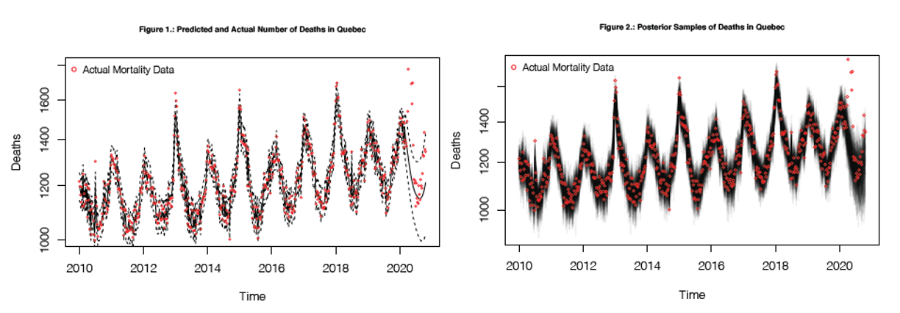
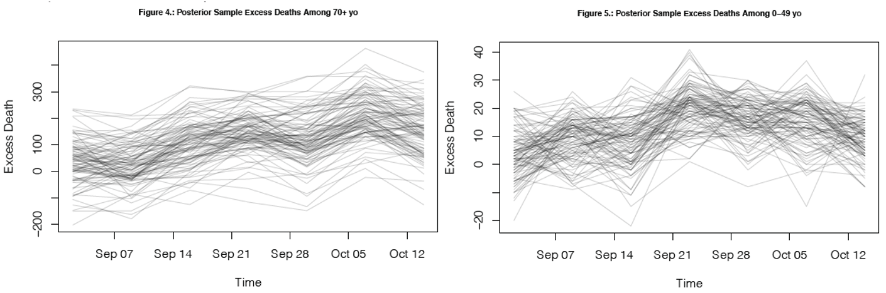

The COVID-19 global pandemic reached Canada in early March. Provinces across Canada have all been impacted in various ways, with Ontario and Québec having the highest number of people infected. This research focuses on the daily mortality counts in Québec as it has only been made available recently.  

The research question of interest involves how COVID infected different age groups at various time periods. There are two main hypotheses for this research project:    

1. **It is hypothesized that during the first wave (March-May, 2020), the epidemic primarily affected the elderly,** in particular over age of 70, as seen from the weekly mortality counts. This hypothesis is based on two evidence: 1) people of older age are one of the most vulnerable groups to COVID-19, and 2) nursing home was one of the hardest hit places in Canada.  

2. **The second part of the hypothesis states that the second wave (September-October 21, date this analysis was conducted) was mainly caused by young people acting irresponsibly,** as there is an increase in deaths in the under 50s in most recent death data whereas the over 70's have no more deaths than would be expected pre-covid.  

# Methods  

In order to fit a statistically robust model that quantifies the problem, weekly mortality data (2010-2020) released from the government of Québec was used to analyze the excess deaths in different age groups at various time periods of the pandemic. *Unfortunately, as of January 2021, the raw data set is no longer available to the public; however, you can view analysis of this data released by Institut de la statistique Québec [here](https://statistique.quebec.ca/en/produit/figure/weekly-deaths-by-age-group-quebec-2010-2020).*    

Since the Poisson family is commonly used for positive and discrete data, we used **Bayesian inference with semi-parametric smoothed time trend to fit a Poisson model** to the data. This analysis involved two main steps:     

* We first used the data prior to March 1st as pre-COVID data to predict mortality what would have otherwise been without COVID in the recent months taking seasonal variations into consideration.  

* We then took 100 random posteriors samples and calculated excess deaths by comparing predicted mortality numbers with actual numbers.  

This model was ran once for deaths of people aged 70 and above, and once for people aged 50 and under, in order to examine the hypothesis that the first wave of COVID-19 primary affected the elderly (70+) and second wave primarily affected younger people (<50). The model is shown below:  
  
$$\begin{aligned}
Y_{i} & \sim Poisson(O_i \lambda_i)\\
log(\lambda_i) & = X_i\beta + U_i + V_i\\
U_i & \sim RW2(\sigma^2)\\
V_i & \sim N(0, \tau^2)\\
X_{i1} & = cos(2\pi t_i/365.25)\\
X_{i2} & = sin(2\pi t_i/365.25)\\
X_{i3} & = cos(2\pi t_i/182.625)\\
X_{i4} & = sin(2\pi t_i/182.625)\\
\end{aligned}$$  

```{r model, eval = FALSE}
# R code
INLA::inla(dead ~ sin12 + sin6 + cos12 + cos6 + 
             f(timeIid, prior='pc.prec', param= c(log(1.2), 0.5)) + 
             f(timeForInla, model = 'rw2', prior='pc.prec', param= c(0.01, 0.5)),
           data=xForInlaTotal, 
           control.predictor = list(compute=TRUE, link=1), 
           control.compute = list(config=TRUE), family='poisson')
```

  
* In this model, the number of deaths $Y_{i}$ follows a Poisson distribution.  

* In order to capture the seasonal variation of deaths, four sinusoidal basis functions $X_i$s were used to capture a wide range of seasonal effects using 12 month and a 6 month frequency cycles.   

* $U_i$ follows the second random walk - random slope, and answers the question 'how much does slope change from one year to the next'.   

* $\sigma$ is in rate per year, with an exponential prior $param=c(0.1, 0.5)$ indicating a median of 0.01. It is a small number because we anticipate the slope change from one year to the next by 0.01.   

* $V_i$ is the independent time variation for over-dispersion and follows a exponential prior of $param=c(log(1.2), 0.5)$, indicating a prior median $\tau$ of log(1.2). This prior was chosen based on our assumption that there will be 20% more deaths and with COVID pandemic, this is a reasonable guess.  

  
# Results  

## 1. Excess Mortality: What would mortality numbers look like in Québec if COVID-19 never happend?  

```{r q2 analysis1, eval = FALSE, include = TRUE, echo = FALSE}
# Plot predicted intensity and random effect
matplot(xForInlaTotal$time, res$summary.fitted.values[, qCols], type= "l", 
        ylim = c(1000, 1800), lty = c(1, 2, 2), col = "black", log = "y", 
        main = 'Figure 1.: Predicted and Actual Number of Deaths in Quebec', 
        ylab = 'Deaths', xlab = 'Time', cex.main = 0.7) 
points(x[x$age == "Total", c("time", "dead")], cex = 0.4, col = "red")
legend("topleft", col = 'red', legend = 'Actual Mortality Data', 
       bty = "n", pch = 1, cex = 0.8)

# Take posterior samples of the intensity
sampleList = INLA::inla.posterior.sample(100, res, selection = list(Predictor = 0))
sampleIntensity = exp(do.call(cbind, Biobase::subListExtract(sampleList, "latent")))
sampleDeaths = matrix(rpois(length(sampleIntensity), ampleIntensity), 
                      nrow(sampleIntensity), ncol(sampleIntensity))

# plot samples and real data
matplot(xForInlaTotal$time, sampleDeaths, col = "#00000010", 
        lwd = 2, lty = 1, type = "l", log = "y", 
        main = 'Figure 2.: Posterior Samples of Deaths in Quebec', 
        ylab = 'Deaths', xlab = 'Time', cex.main = 0.7)
points(x[x$age == "Total", c("time", "dead")], col = "red", cex = 0.5)
legend("topleft", col = 'red', legend = 'Actual Mortality Data', 
       bty = "n", pch = 1, cex = 0.8)

# calculate excess deaths
xPostCovidTotal = xPostCovid[xPostCovid$age == "Total", ]
xPostCovidForecast = sampleDeaths[match(xPostCovidTotal$time, xForInlaTotal$time), ]
excessDeaths = xPostCovidTotal$dead - xPostCovidForecast

# Total excess deaths march-may inclusive
excessDeathsSub = excessDeaths[xPostCovidTotal$time > as.Date("2020/03/01") & xPostCovidTotal$time < as.Date("2020/10/21"), ]
excessDeathsInPeriod = apply(excessDeathsSub, 2, sum) 

# histogram of excess deaths from poterior samples
hist(excessDeathsInPeriod, main = 'Figure 3.: Histogram of Total Excess Deaths 
     from Posterior Samples, March 1st - October 21st, 2020', 
     xlab = 'Excess Deaths', cex.main = 0.7)

```
  

  
When examining COVID related questions, it is important first to recognize the severity of COVID and that COVID-19 is indeed more deadly than the common flu. **Figure 1 shows the predicted number of deaths in a world without COVID and the actual deaths during COVID months. Similarly, figure 2 represents deaths generated from 100 posterior samples in a COVID-free world, overlayed with actual data on top.** March 1st was determined as the day COVID hit Canada, therefore the cut off point for data used for predictions. It is easily observed from the figure that excess death was created as a result of COVID, especially around April (first wave) and recent months (second wave).   

  

Indeed, the median of excess deaths from posterior samples suggest that the total number of excess death in Québec, most likely caused by COVID, from March 1st to October 21st is around **6000**, as suggested in Figure 3.  

## 2. Seniors were the most vulnerable group during first wave (94% of total excess deaths).  


```{r analysishypothesis1, eval = FALSE, include=TRUE}
# total
### calculate excess deaths
xPostCovidTotal = xPostCovid[xPostCovid$age == "Total", ]
xPostCovidForecast = sampleDeaths[match(xPostCovidTotal$time, xForInlaTotal$time), ]
excessDeaths = xPostCovidTotal$dead - xPostCovidForecast

### Total excess deaths march-may inclusive
excessDeathsSub = excessDeaths[xPostCovidTotal$time > as.Date("2020/03/01") & xPostCovidTotal$time < as.Date("2020/06/01"), ]
excessDeathsInPeriod = apply(excessDeathsSub, 2, sum) 
wave1_total <- round(quantile(excessDeathsInPeriod))

# 70+
### fit a model for 70+ yo deaths in INLA
xForInlaTotal70= xForInla[xForInla$age == '70 years old and over', ] 
### model
res70 = inla(dead ~ sin12 + sin6 + cos12 + cos6 +
             f(timeIid, prior='pc.prec', param= c(log(1.2), 0.5)) + 
             f(timeForInla, model = 'rw2', prior='pc.prec', param= c(0.01, 0.5)),
           data=xForInlaTotal70,
           control.predictor = list(compute=TRUE, link=1), 
           control.compute = list(config=TRUE), family='poisson')
### Take posterior samples of the intensity
sampleList = INLA::inla.posterior.sample(100, res70, selection = list(Predictor = 0))
sampleIntensity = exp(do.call(cbind, Biobase::subListExtract(sampleList, "latent")))
sampleDeaths = matrix(rpois(length(sampleIntensity), sampleIntensity), 
                      nrow(sampleIntensity), ncol(sampleIntensity))
### calculate excess deaths
xPostCovidTotal = xPostCovid[xPostCovid$age == "70 years old and over", ]
xPostCovidForecast = sampleDeaths[match(xPostCovidTotal$time, xForInlaTotal$time), ]
excessDeaths = xPostCovidTotal$dead - xPostCovidForecast
### Total excess deaths march-may inclusive 
excessDeathsSub = excessDeaths[xPostCovidTotal$time > as.Date("2020/03/01") & 
                                 xPostCovidTotal$time < as.Date("2020/06/01"), ]
excessDeathsInPeriod = apply(excessDeathsSub, 2, sum) 
wave1_70 <- round(quantile(excessDeathsInPeriod))

# table
c <- cbind(wave1_70, wave1_total)
c %>%
  knitr::kable(caption = "Quantiles of Posterior Sample Excess Deaths, 
               March 1st - May 31st, 2020" , booktabs = T, digits = 6, 
               col.names = c('70+ Years of Age', 'Total')) %>%
  kableExtra::kable_classic(full_width = F, html_font = "Cambria") %>%
  kableExtra::kable_styling(latex_options = c("HOLD_position", "striped"))
```

  

The first part of our hypothesis is that the first wave of COVID, from March to May, primarily affected older people. Table 3 shows the quantile of posterior sample excess deaths, from March 1st to May 31st, for the age group 70 and above and all age groups. Excess deaths for all population is around 4700 deaths for this time period, while excess deaths for 70+ age group is around 4400, making up 94% of all deaths. This confirms our first hypothesis that first wave of COVID affected primarily older people.  

## 3. Senior age group displayed high vulnerability again during the second wave.  

```{r secondhypothesis, eval = FALSE}
# 70+ 
### Take posterior samples of the intensity
sampleList = INLA::inla.posterior.sample(100, res70, selection = list(Predictor = 0))
sampleIntensity = exp(do.call(cbind, Biobase::subListExtract(sampleList, "latent")))
sampleDeaths = matrix(rpois(length(sampleIntensity),
                            sampleIntensity), nrow(sampleIntensity), 
                      ncol(sampleIntensity))
#### calculate excess deaths
xPostCovidTotal = xPostCovid[xPostCovid$age == "70 years old and over", ]
xPostCovidTotal = xPostCovidTotal[xPostCovidTotal$time > as.Date("2020/09/01") & xPostCovidTotal$time < as.Date("2020/10/21"),]
xPostCovidForecast = sampleDeaths[match(xPostCovidTotal$time, xForInlaTotal70$time), ]
excessDeaths = xPostCovidTotal$dead - xPostCovidForecast
#### plot samples of excess deaths
temp70 <- round(quantile(excessDeaths))
matplot(xPostCovidTotal$time, excessDeaths, type = "l", lty = 1, col = "#00000030", 
        main = 'Figure 4.: Posterior Sample Excess Deaths Among 70+ yo', 
        xlab = 'Time', ylab = 'Excess Death', cex.main = 0.7)

# < 50
### fit a model for 70+ yo deaths in INLA
xForInlaTotal50= xForInla[xForInla$age == '0-49 years old', ] 
### model
res50 = inla(dead ~ sin12 + sin6 + cos12 + cos6 +
             f(timeIid, prior='pc.prec', param= c(log(1.2), 0.5)) + 
             f(timeForInla, model = 'rw2', prior='pc.prec', param= c(0.01, 0.5)),
           data=xForInlaTotal50,
           control.predictor = list(compute=TRUE, link=1), 
           control.compute = list(config=TRUE), family='poisson')
### Take posterior samples of the intensity
sampleList = INLA::inla.posterior.sample(100, res50, selection = list(Predictor = 0))
sampleIntensity = exp(do.call(cbind, Biobase::subListExtract(sampleList, "latent")))
sampleDeaths = matrix(rpois(length(sampleIntensity),
                            sampleIntensity), nrow(sampleIntensity), 
                      ncol(sampleIntensity))
### calculate excess deaths
xPostCovidTotal = xPostCovid[xPostCovid$age == "0-49 years old", ]
xPostCovidTotal = xPostCovidTotal[xPostCovidTotal$time > as.Date("2020/09/01") & xPostCovidTotal$time < as.Date("2020/10/21"),]
xPostCovidForecast = sampleDeaths[match(xPostCovidTotal$time, xForInlaTotal50$time), ]
excessDeaths = xPostCovidTotal$dead - xPostCovidForecast
### plot samples of excess deaths
temp50 <- round(quantile(excessDeaths))
matplot(xPostCovidTotal$time, excessDeaths, type = "l", lty = 1, col = "#00000030", 
        main = 'Figure 5.: Posterior Sample Excess Deaths Among 0-49 yo', 
        xlab = 'Time', ylab = 'Excess Death', cex.main = 0.7)

# table combined
d<- cbind(temp70, temp50)
d %>%
  knitr::kable(caption = "Quantile of Posterior Sample Excess Deaths, 
               Sep 1st - Oct 21st, 2020" , booktabs = T, digits = 6, 
               col.names = c('70+ Year of Age', '0-49 Years of Age')) %>%
  kableExtra::kable_classic(full_width = F, html_font = "Cambria") %>%
  kableExtra::kable_styling(latex_options = c("HOLD_position", "striped"))
```

  


As for our second hypothesis, we calculated excess deaths among 70+ year old age group (as shown in figure 4) and among 0-49 year old age group (as shown in figure 5) during both first and second wave of COVID-19. We define first wave as the time between March 1st and May 31st. We define the second wave as the time between September 1st and the most recent data, during the week of October 21st. As seen from table 4, the older population is again, similarly to the first wave, most vulnerable to COVID-19, as the excess deaths is around 110, whereas the excess death for 0-49 year-old is around 12.  
  
# Discussion  

COVID-19 is more serious than the seasonal flu and has caused great number of excess deaths. Although many may believe the second wave was caused by irresponsible young people, we conclude that young people are not the most vulnerable population from such infectious disease. In fact, excess deaths are highest among people aged 70 and above, during both first and second wave of the pandemic. **Further investigation is needed on infection data in order to draw conclusion on whether it was mostly young people who were involved in the spreading of COVID-19 during second wave.**  


